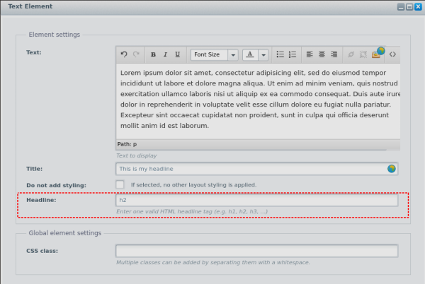

# Headlines for text elements
## About This Plugin
This plugin adds the possibility to output a text element's headline inside an HTML headline tag.



## Installation
### Via Plugin Manager
1. Download the latest release as .zip file from here: 
[Releases](https://github.com/simkli/SimklHideSingleValueFacet/releases)

2. Refer to this guide (only the last step): [Manually installing plugins](https://en-community.shopware.com/Licensing-and-installing-a-licensed-plugin-_detail_1638.html#Manually_installing_plugins)

### Via Git
In the root of your Shopware Installation run
```
$ cd custom/plugins
$ git clone https://github.com/simkli/SimklHideSingleValueFacet.git
$ ../../bin/console sw:plugin:install refresh
$ ../../bin/console sw:plugin:install --activate SimklHideSingleValueFacet
$ ../../bin/console sw:cache:clear
```
## License

Please see [License File](LICENSE) for more information.